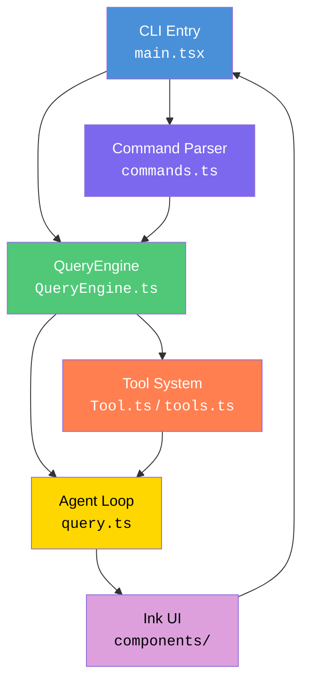
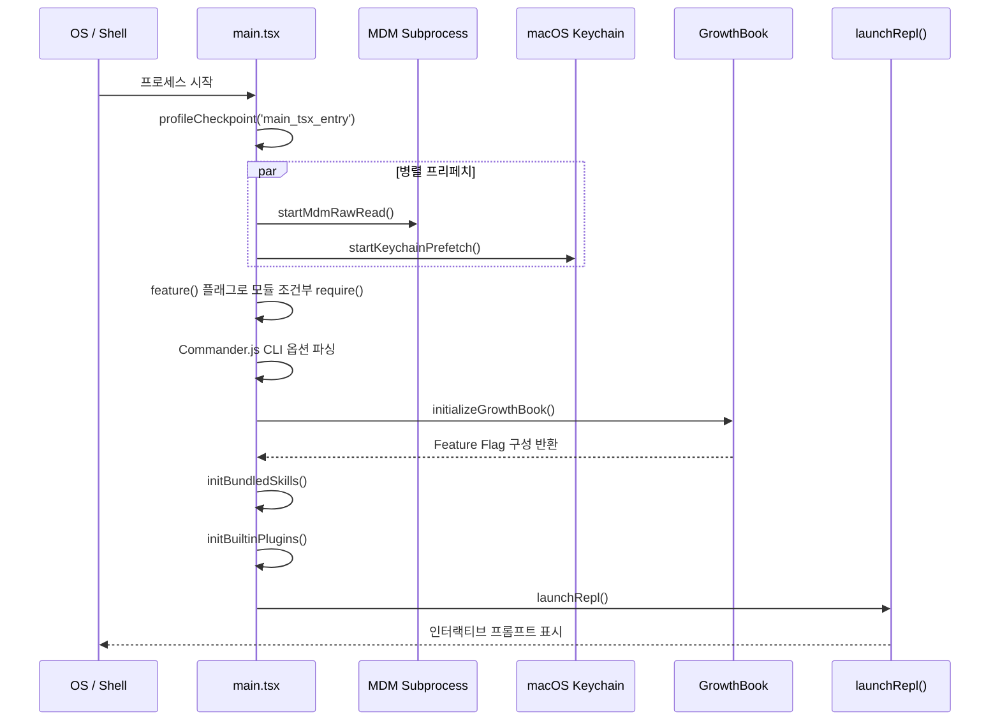

# 아키텍처 개요

> **레벨**: 입문 (Level 1) | **대상**: Claude Code CLI의 전체 구조를 처음 파악하려는 개발자

---

## 1. 기술 스택

| 계층 | 기술 |
|------|------|
| **Runtime** (런타임) | [Bun](https://bun.sh) — Node.js 호환 고성능 JS 런타임 |
| **Language** (언어) | TypeScript strict 모드 (`tsconfig` `strict: true`) |
| **UI** | [React](https://react.dev) + [Ink](https://github.com/vadimdemedes/ink) — 터미널 UI를 React 컴포넌트로 렌더링 |
| **Schema** (스키마 검증) | [Zod](https://zod.dev) v4 — 런타임 타입 검증 |
| **CLI** | [Commander.js](https://github.com/tj/commander.js) (`@commander-js/extra-typings`) |
| **Protocols** (프로토콜) | [MCP SDK](https://modelcontextprotocol.io) (Model Context Protocol), LSP (Language Server Protocol) |
| **Search** (검색) | [ripgrep](https://github.com/BurntSushi/ripgrep) — 고속 파일 내용 검색 |
| **Auth** (인증) | OAuth 2.0, JWT, macOS Keychain |
| **Telemetry** (원격 측정) | [OpenTelemetry](https://opentelemetry.io) + gRPC |
| **Feature Flags** (기능 플래그) | [GrowthBook](https://www.growthbook.io) + `bun:bundle` (`feature()`) |

---

## 2. 고수준 아키텍처

아래 다이어그램은 사용자 입력이 처리되는 6개의 핵심 계층을 보여준다.



| 계층 | 역할 |
|------|------|
| CLI Entry | 프로세스 진입점, 사이드이펙트 초기화, 옵션 파싱 |
| Command Parser | 슬래시 커맨드(`/commit`, `/doctor` 등) 등록 및 라우팅 |
| QueryEngine | 세션 상태, 모델 설정, 권한 컨텍스트를 통합 관리 |
| Tool System | 각 Tool의 입력 스키마 정의 및 실행 위임 |
| Agent Loop | Claude API 호출 → 도구 실행 → 결과 반환 반복 루프 |
| Ink UI | React 컴포넌트로 터미널에 실시간 렌더링 |

---

## 3. 디렉토리 ↔ 레이어 매핑

`src/` 하위 35개 서브디렉토리와 아키텍처 계층의 대응 관계는 다음과 같다.

| 디렉토리 | 아키텍처 계층 | 설명 |
|----------|--------------|------|
| `entrypoints/` | CLI Entry | SDK 진입점, MCP 진입점, 초기화(`init.ts`) |
| `cli/` | CLI Entry | CLI 전용 유틸리티 |
| `bootstrap/` | CLI Entry | 세션 전역 상태(`state.ts`) |
| `commands/` | Command Parser | 슬래시 커맨드 구현체 모음 |
| `QueryEngine.ts` | QueryEngine | 쿼리 설정 타입 및 실행 엔진 |
| `query/` | QueryEngine | API 호출 및 스트리밍 처리 |
| `tools/` | Tool System | 개별 Tool 구현체 디렉토리 |
| `Tool.ts` / `tools.ts` | Tool System | Tool 타입 정의 및 레지스트리 |
| `components/` | Ink UI | React/Ink 터미널 UI 컴포넌트 |
| `ink/` | Ink UI | Ink 렌더링 헬퍼 및 터미널 I/O |
| `screens/` | Ink UI | 전체 화면 단위 뷰 |
| `hooks/` | Ink UI / QueryEngine | React 훅 및 권한 훅 |
| `state/` | QueryEngine | AppState 스토어, 상태 변환 |
| `context/` | QueryEngine | 세션 컨텍스트(알림, 통계 등) |
| `services/` | 공통 서비스 | API 클라이언트, MCP, LSP, 분석, 플러그인 |
| `utils/` | 공통 유틸 | 인증, 설정, 파일, 모델, 권한 등 |
| `types/` | 공통 타입 | 공유 TypeScript 인터페이스 |
| `schemas/` | 공통 타입 | Zod 스키마 정의 |
| `constants/` | 공통 상수 | 제품 상수, OAuth 설정 등 |
| `skills/` | Tool System | 번들 스킬 구현 |
| `plugins/` | 공통 서비스 | 번들 플러그인 시스템 |
| `coordinator/` | Agent Loop | 다중 에이전트 코디네이터 |
| `assistant/` | Agent Loop | KAIROS 어시스턴트 모드 |
| `tasks/` | Agent Loop | 백그라운드 태스크 관리 |
| `server/` | 네트워크 | Direct Connect 세션 서버 |
| `remote/` | 네트워크 | 원격 세션 관리 |
| `bridge/` | 네트워크 | REPL 브릿지 (원격 제어) |
| `memdir/` | QueryEngine | 메모리(CLAUDE.md) 로딩 |
| `migrations/` | CLI Entry | 설정 마이그레이션 스크립트 |
| `keybindings/` | Ink UI | 키보드 단축키 처리 |
| `vim/` | Ink UI | Vim 에디터 모드 통합 |
| `voice/` | CLI Entry | 음성 입력 모드 |
| `outputStyles/` | Ink UI | 출력 포맷 스타일 |
| `native-ts/` | 공통 유틸 | 네이티브 바인딩 |
| `moreright/` | 공통 유틸 | 확장 유틸리티 |
| `upstreamproxy/` | 네트워크 | 업스트림 프록시 설정 |
| `buddy/` | Agent Loop | 어드바이저(Buddy) 에이전트 |

---

## 4. 부트스트랩 과정

`main.tsx`는 다음 순서로 Claude Code를 초기화한다.

### 4-1. 단계 요약

1. **사이드이펙트 임포트** — 파일 최상단에서 즉시 실행되는 세 가지 병렬 초기화:
   - `profileCheckpoint('main_tsx_entry')` — 스타트업 프로파일러에 진입 시각 기록
   - `startMdmRawRead()` — MDM(Mobile Device Management) 서브프로세스(`plutil`/`reg query`)를 백그라운드에서 실행
   - `startKeychainPrefetch()` — macOS Keychain에서 OAuth 토큰과 레거시 API 키를 병렬로 선읽기(약 65ms 절감)

2. **Feature Flag 게이팅** — `bun:bundle`의 `feature()` 함수로 빌드 시점에 사용하지 않는 코드를 제거 (Dead Code Elimination):
   ```typescript
   const coordinatorModeModule = feature('COORDINATOR_MODE')
     ? require('./coordinator/coordinatorMode.js')
     : null
   const assistantModule = feature('KAIROS')
     ? require('./assistant/index.js')
     : null
   ```

3. **지연 `require()`** — 순환 의존성(circular dependency)을 끊기 위해 무거운 모듈을 함수 내부에서 동적 로드:
   ```typescript
   const getTeammateUtils = () => require('./utils/teammate.js')
   ```

4. **Commander.js CLI 파싱** — `@commander-js/extra-typings`로 타입 안전한 CLI 옵션 파싱

5. **GrowthBook 초기화** — `initializeGrowthBook()`으로 Feature Flag 원격 구성 로드

6. **스킬 및 플러그인 등록**:
   - `initBundledSkills()` — 번들 스킬 레지스트리에 등록
   - `initBuiltinPlugins()` — 내장 플러그인 초기화

7. **`launchRepl()`** — 인터랙티브 REPL(Read-Eval-Print Loop) 시작

### 4-2. 부트스트랩 시퀀스 다이어그램



---

## 5. 핵심 설계 원칙

### 병렬 Prefetch (병렬 선읽기)

MDM 설정, Keychain 인증 정보, API 응답을 프로세스 시작과 동시에 병렬로 초기화한다. 이를 통해 최초 프롬프트가 나타나기까지의 지연 시간(약 65ms 이상)을 절감한다.

### Dead Code Elimination (빌드 시 코드 제거)

`bun:bundle`의 `feature()` 함수는 빌드 타임에 평가된다. 비활성화된 플래그(`COORDINATOR_MODE`, `KAIROS`, `VOICE_MODE` 등)에 해당하는 코드 경로는 최종 번들에서 완전히 제거된다. 이는 번들 크기와 런타임 메모리를 줄인다.

### 지연 로딩 (Lazy Loading)

`teammate.ts → AppStateStore → main.tsx`와 같은 순환 의존성을 끊기 위해, 무거운 모듈은 최상위 `import` 대신 함수 호출 시점의 `require()`로 동적 로드한다. React/Ink처럼 무거운 UI 모듈도 실제 사용 직전까지 로드를 미룬다.

### 레지스트리 패턴 (Registry Pattern)

Tool과 Command는 중앙 레지스트리에 등록된다.

- **Tool 레지스트리** (`tools.ts`): `BashTool`, `FileReadTool`, `FileEditTool`, `GrepTool`, `WebSearchTool` 등 모든 Tool 인스턴스를 배열로 관리. `getTools()` 함수가 현재 권한·플래그 상태에 맞는 Tool 목록을 반환한다.
- **Command 레지스트리** (`commands.ts`): `/commit`, `/doctor`, `/mcp`, `/resume` 등 슬래시 커맨드를 `getCommands()` 함수로 노출한다. `filterCommandsForRemoteMode()`로 원격 세션에서 허용되지 않는 커맨드를 필터링한다.

`QueryEngineConfig` 타입이 두 레지스트리를 통합하여 엔진에 주입한다:

```typescript
export type QueryEngineConfig = {
  cwd: string
  tools: Tools
  commands: Command[]
  mcpClients: MCPServerConnection[]
  agents: AgentDefinition[]
  canUseTool: CanUseToolFn
  // ...
}
```

---

## 내비게이션

- **다음**: [요청 생명주기](request-lifecycle.md)
- **상위**: [목차](../README.md)
