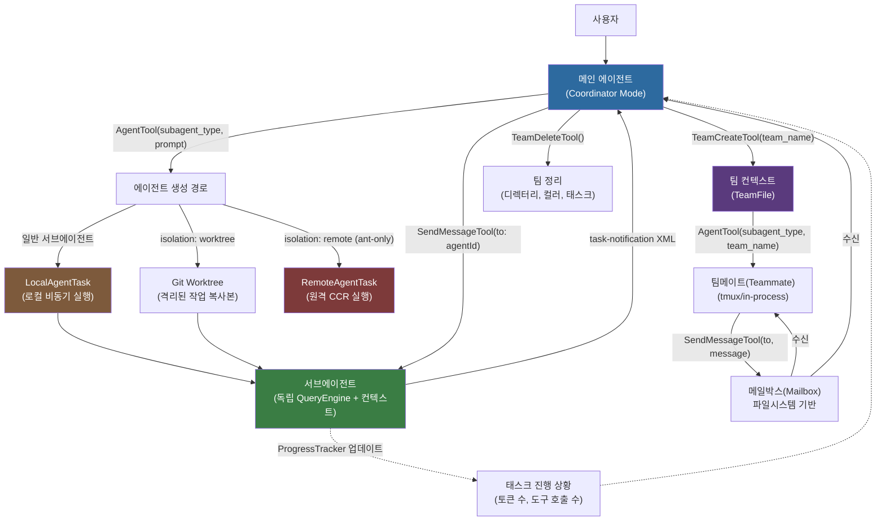

# 에이전트 오케스트레이션: 멀티에이전트 시스템 분석

## 1. 개요

Claude Code의 멀티에이전트(multi-agent) 오케스트레이션(orchestration) 시스템은 단일 세션 안에서 여러 서브에이전트(subagent)를 동시에 생성하고 조율하는 기반 구조다. 이 시스템은 복잡한 작업을 독립적인 단위로 분해하고 병렬 실행하여 성능과 컨텍스트 격리(context isolation)를 동시에 달성한다.

**핵심 구성 요소와 파일 위치:**

| 구성 요소 | 경로 |
|-----------|------|
| Coordinator Mode (코디네이터 모드) | `src/coordinator/coordinatorMode.ts` |
| AgentTool (에이전트 생성 도구) | `src/tools/AgentTool/` |
| TeamCreateTool / TeamDeleteTool | `src/tools/TeamCreateTool/`, `src/tools/TeamDeleteTool/` |
| SendMessageTool (에이전트 간 통신) | `src/tools/SendMessageTool/` |
| Task 시스템 | `src/tasks/` |

이 문서는 각 구성 요소의 구현 세부 사항과 상호작용 방식을 분석한다.

---

## 2. 아키텍처 다이어그램

전체 시스템의 데이터 흐름은 다음과 같다.



**핵심 설계 원칙:** 모든 서브에이전트는 자신만의 독립적인 `QueryEngine` 인스턴스와 메시지 컨텍스트를 가진다. 부모 에이전트는 서브에이전트의 내부 상태를 직접 접근할 수 없으며, 오직 `task-notification` XML 메시지를 통해 결과를 수신한다.

---

## 3. Coordinator Mode (코디네이터 모드)

### 3.1 기본 동작: `isCoordinatorMode()`

```typescript
// src/coordinator/coordinatorMode.ts
export function isCoordinatorMode(): boolean {
  if (feature('COORDINATOR_MODE')) {
    return isEnvTruthy(process.env.CLAUDE_CODE_COORDINATOR_MODE)
  }
  return false
}
```

코디네이터 모드는 두 겹의 게이팅(gating)을 통해 활성화된다.

1. **피처 플래그(feature flag) 게이트**: `feature('COORDINATOR_MODE')` — Bun 번들러의 `bun:bundle` 모듈이 제공하는 빌드 타임 상수다. 플래그가 `false`이면 번들러가 이 코드 경로 전체를 데드 코드(dead code)로 제거한다.
2. **환경 변수 게이트**: `CLAUDE_CODE_COORDINATOR_MODE` 환경 변수가 truthy 값으로 설정되어야 한다.

이중 게이트 구조는 프로덕션 빌드에서 멀티에이전트 기능 코드를 완전히 제거할 수 있도록 한다.

### 3.2 세션 재개 시 모드 일치: `matchSessionMode()`

```typescript
export function matchSessionMode(
  sessionMode: 'coordinator' | 'normal' | undefined,
): string | undefined
```

저장된 세션을 재개할 때 현재 환경의 모드와 세션에 기록된 모드가 다를 수 있다. 이 함수는 `process.env.CLAUDE_CODE_COORDINATOR_MODE`를 런타임에 직접 수정하여 불일치를 해소한다. `isCoordinatorMode()`가 환경 변수를 캐시 없이 매번 직접 읽기 때문에 이 방식이 작동한다.

### 3.3 워커 도구 컨텍스트: `getCoordinatorUserContext()`

코디네이터 모드가 활성화되면 메인 에이전트는 워커(worker) 에이전트들이 어떤 도구에 접근할 수 있는지 알아야 한다. `getCoordinatorUserContext()`는 이 정보를 `workerToolsContext` 키로 반환한다.

```typescript
// 내부 도구 집합 (워커에게 노출되지 않음)
const INTERNAL_WORKER_TOOLS = new Set([
  TEAM_CREATE_TOOL_NAME,
  TEAM_DELETE_TOOL_NAME,
  SEND_MESSAGE_TOOL_NAME,
  SYNTHETIC_OUTPUT_TOOL_NAME,
])
```

`CLAUDE_CODE_SIMPLE` 환경 변수가 설정된 경우 워커 도구를 Bash, Read, Edit 세 가지로만 제한하는 단순 모드도 지원한다.

### 3.4 코디네이터 시스템 프롬프트

`getCoordinatorSystemPrompt()`는 다음 단계로 구성된 멀티에이전트 워크플로를 코디네이터에게 지시하는 시스템 프롬프트를 생성한다.

| 단계 | 담당 | 목적 |
|------|------|------|
| Research (조사) | 워커 (병렬) | 코드베이스 탐색, 문제 파악 |
| Synthesis (종합) | 코디네이터 | 발견 사항 읽기, 구현 명세 작성 |
| Implementation (구현) | 워커 | 변경 적용, 커밋 |
| Verification (검증) | 워커 | 변경 사항 테스트 |

핵심 원칙은 **"절대로 이해를 위임하지 말라(Never delegate understanding)"**이다. 코디네이터는 워커의 결과를 직접 종합하여 다음 워커에게 구체적인 파일 경로, 줄 번호, 변경 내용을 포함한 지시를 작성해야 한다.

### 3.5 Scratchpad (스크래치패드) 게이트

```typescript
function isScratchpadGateEnabled(): boolean {
  return checkStatsigFeatureGate_CACHED_MAY_BE_STALE('tengu_scratch')
}
```

`tengu_scratch` 피처 게이트가 활성화되면 워커들이 퍼미션 프롬프트 없이 읽고 쓸 수 있는 공유 스크래치패드 디렉터리가 활성화된다. 스크래치패드는 워커 간 지식을 영속적으로 공유하는 메커니즘이다.

주목할 점은 `isScratchpadGateEnabled()`가 `src/utils/permissions/filesystem.ts`의 `isScratchpadEnabled()`와 동일한 게이트를 검사하지만 함수를 재사용하지 않는다는 것이다. 이는 `filesystem.ts`를 가져오면 `filesystem → permissions → ... → coordinatorMode`의 순환 의존성(circular dependency)이 발생하기 때문이다. 이 설계 결정은 코드 주석에 명시되어 있다.

---

## 4. AgentTool 분석

### 4.1 에이전트 생성 메커니즘

`AgentTool.tsx`는 새 에이전트를 생성하는 핵심 도구다. 입력 스키마(input schema)는 피처 플래그에 따라 동적으로 구성된다.

```typescript
// 기본 입력 파라미터
const baseInputSchema = lazySchema(() => z.object({
  description: z.string(),      // 3-5 단어의 짧은 작업 설명
  prompt: z.string(),           // 에이전트에게 전달할 실제 지시
  subagent_type: z.string().optional(),  // 전문 에이전트 타입
  model: z.enum(['sonnet', 'opus', 'haiku']).optional(),
  run_in_background: z.boolean().optional(),
}));
```

`KAIROS` 피처 플래그가 활성화된 경우 `cwd` 파라미터(작업 디렉터리 재정의)가 추가된다. `run_in_background`는 `CLAUDE_CODE_DISABLE_BACKGROUND_TASKS` 환경 변수 또는 Fork Subagent 기능이 활성화된 경우 스키마에서 제거된다.

**자동 백그라운드 타임아웃:**

```typescript
function getAutoBackgroundMs(): number {
  if (isEnvTruthy(process.env.CLAUDE_AUTO_BACKGROUND_TASKS) ||
      getFeatureValue_CACHED_MAY_BE_STALE('tengu_auto_background_agents', false)) {
    return 120_000;  // 2분 후 자동으로 백그라운드로 전환
  }
  return 0;
}
```

포그라운드(foreground)로 실행 중인 에이전트가 2분을 초과하면 자동으로 백그라운드로 전환된다.

### 4.2 AgentDefinition 타입 계층

에이전트 정의는 세 가지 소스에서 로드된다.

```
AgentDefinition (유니언 타입)
├── BuiltInAgentDefinition   (source: 'built-in')
│   └── getSystemPrompt(params) — toolUseContext 접근 가능
├── CustomAgentDefinition    (source: 'userSettings' | 'projectSettings' | ...)
│   └── getSystemPrompt()    — 클로저(closure)로 마크다운 내용 캡처
└── PluginAgentDefinition    (source: 'plugin')
    └── getSystemPrompt()    — 플러그인 메타데이터 포함
```

`getSystemPrompt`가 함수인 이유는 메모리(memory) 기능이 활성화된 경우 에이전트 메모리 프롬프트를 동적으로 결합해야 하기 때문이다. 정적 문자열이 아닌 클로저를 사용하여 이를 구현한다.

**에이전트 우선순위 (덮어쓰기 순서):**

```
built-in < plugin < userSettings < projectSettings < flagSettings < policySettings
```

동일한 `agentType` 이름이 여러 소스에 존재하면 우선순위가 높은 소스가 낮은 소스를 덮어쓴다. 예를 들어 프로젝트 설정의 커스텀 에이전트는 빌트인 에이전트를 같은 이름으로 오버라이드할 수 있다.

### 4.3 에이전트 로딩: `loadAgentsDir.ts`

`getAgentDefinitionsWithOverrides(cwd)`는 `lodash-es/memoize`로 메모화(memoize)되어 동일한 작업 디렉터리에 대해 한 번만 파일시스템을 읽는다.

마크다운 에이전트 파일 프론트매터(frontmatter) 구조:

```yaml
---
name: my-agent
description: 이 에이전트를 사용할 때
model: sonnet
effort: high
permissionMode: default
isolation: worktree
memory: user
background: false
maxTurns: 50
tools: [Bash, Read, Edit]
---
에이전트 시스템 프롬프트 내용...
```

`parseAgentFromMarkdown()`은 다음을 수행한다.

- `isolation: 'remote'`는 `USER_TYPE === 'ant'`(Anthropic 내부 빌드)에서만 허용한다.
- `memory` 필드가 설정되면 `FILE_WRITE_TOOL_NAME`, `FILE_EDIT_TOOL_NAME`, `FILE_READ_TOOL_NAME`을 도구 목록에 자동 주입한다.
- `HooksSchema`로 훅(hook)을 파싱한다. `HooksSchema`가 lazy인 이유는 `AppState → loadAgentsDir → settings/types`의 순환 의존성을 모듈 로드 시점에 끊기 위해서다.

### 4.4 Fork Subagent (포크 서브에이전트)

`forkSubagent.ts`는 부모 에이전트의 전체 대화 컨텍스트를 상속받는 자식 에이전트를 생성하는 실험적 기능을 구현한다.

```typescript
export function isForkSubagentEnabled(): boolean {
  if (feature('FORK_SUBAGENT')) {
    if (isCoordinatorMode()) return false  // 코디네이터와 상호 배타적
    if (getIsNonInteractiveSession()) return false
    return true
  }
  return false
}
```

**포크 메커니즘의 핵심: 프롬프트 캐시 공유**

모든 포크 자식은 바이트 동일(byte-identical)한 API 요청 접두사를 생성해야 캐시 히트(cache hit)가 가능하다. `buildForkedMessages()`는 이를 위해 다음 구조를 만든다.

```
[...부모 히스토리, assistant(모든_tool_use 블록), user(플레이스홀더_results..., 자식별_지시문)]
```

모든 `tool_result` 블록에 동일한 플레이스홀더 텍스트 `"Fork started — processing in background"`를 사용하고, 오직 마지막 텍스트 블록만 자식별로 다르게 함으로써 캐시 히트율을 극대화한다.

**포크 자식 규칙 (buildChildMessage에서 강제):**

포크 자식 메시지는 `<fork-boilerplate>` 태그로 시작하며 다음을 강제한다.
- 서브에이전트를 재귀적으로 생성하지 말 것
- 도구 호출 사이에 텍스트를 출력하지 말 것
- 응답은 반드시 "Scope:"로 시작할 것
- 파일을 수정한 경우 커밋 후 해시를 보고할 것

재귀 포크 방지는 `isInForkChild()`가 대화 히스토리에서 `<fork-boilerplate>` 태그를 탐지하는 방식으로 구현된다.

### 4.5 에이전트 실행: `runAgent.ts`

`runAgent.ts`는 서브에이전트의 전체 실행 수명주기(lifecycle)를 관리한다.

**에이전트 전용 MCP 서버 초기화:**

에이전트 정의의 프론트매터에 `mcpServers`가 지정된 경우, `initializeAgentMcpServers()`가 부모의 MCP 클라이언트에 추가로 에이전트 전용 서버를 연결한다. 에이전트 종료 시 정리 함수가 호출되어 연결을 해제한다.

**파일 상태 캐시 상속:**

서브에이전트는 부모의 파일 상태 캐시를 `cloneFileStateCache()`로 복제하여 시작한다. 이를 통해 부모가 이미 읽은 파일 정보를 서브에이전트가 재활용할 수 있다.

**도구 풀(tool pool) 구성:**

`resolveAgentTools()`는 에이전트 정의의 `tools`(허용 목록) 및 `disallowedTools`(거부 목록)을 부모의 도구 풀에 적용하여 서브에이전트의 최종 도구 집합을 결정한다.

### 4.6 에이전트 색상 관리

멀티에이전트 UI에서 각 에이전트를 시각적으로 구별하기 위해 `agentColorManager.ts`가 에이전트 타입별 색상을 관리한다. 에이전트 정의의 `color` 필드나 자동 할당을 통해 색상이 지정된다.

---

## 5. 팀 시스템

### 5.1 TeamCreateTool

`TeamCreateTool`은 에이전트 스웜(swarm) 기능이 활성화된 경우(`isAgentSwarmsEnabled()`)에만 사용 가능하다.

```typescript
// 팀 생성 입력 파라미터
z.strictObject({
  team_name: z.string(),        // 팀 이름
  description: z.string().optional(),
  agent_type: z.string().optional(), // 팀 리더의 역할 타입
})
```

**팀 생성 시 수행 작업:**

1. **팀 파일 생성**: `TeamFile` 구조를 파일시스템에 기록한다. 동일 이름의 팀이 이미 존재하면 새로운 고유 이름을 자동 생성한다.
2. **태스크 디렉터리 초기화**: `resetTaskList()`와 `ensureTasksDir()`로 팀 전용 태스크 목록 디렉터리를 생성한다. 팀마다 태스크 번호가 1부터 시작한다.
3. **리더 팀 이름 등록**: `setLeaderTeamName()`을 호출하여 `getTaskListId()`가 세션 ID 대신 팀 이름을 반환하도록 한다.
4. **AppState 업데이트**: `teamContext`를 설정하여 현재 세션이 팀 컨텍스트를 인식하게 한다.
5. **세션 정리 등록**: `registerTeamForSessionCleanup()`으로 세션 종료 시 팀 디렉터리가 자동 정리되도록 한다.

**리더(leader)와 팀메이트(teammate) 구분:**

팀 리더는 `CLAUDE_CODE_AGENT_ID` 환경 변수를 설정하지 않는다. 이를 통해 `isTeammate()`가 리더에 대해 `false`를 반환하고, 인박스(inbox) 폴링(polling)을 비롯한 팀메이트 전용 동작이 리더에게는 적용되지 않는다.

### 5.2 TeamDeleteTool

팀 삭제는 입력 파라미터가 없는 단순한 정리 작업이다.

**삭제 전 안전 검사:**

```typescript
const activeMembers = nonLeadMembers.filter(m => m.isActive !== false)
if (activeMembers.length > 0) {
  // 활성 멤버가 있으면 삭제 거부
}
```

`isActive !== false`로 판단하는 이유는 `isActive`가 정의되지 않은 멤버(undefined)를 활성 상태로 간주하기 때문이다. `false`로 명시적으로 설정된 경우에만 유휴/종료 상태로 판단한다.

**정리 순서:**

1. 팀 파일 및 관련 디렉터리 삭제 (`cleanupTeamDirectories`)
2. 세션 정리 목록에서 제거 (`unregisterTeamForSessionCleanup`)
3. 에이전트 색상 할당 초기화 (`clearTeammateColors`)
4. 리더 팀 이름 초기화 (`clearLeaderTeamName`)
5. AppState에서 `teamContext` 및 `inbox` 제거

### 5.3 SendMessageTool (에이전트 간 통신)

`SendMessageTool`은 여러 통신 경로를 단일 인터페이스로 통합한다.

**메시지 라우팅 결정 트리:**

```
SendMessageTool(to, message)
├── to == "bridge:<session-id>"  →  원격 제어 세션 (사용자 승인 필요)
├── to == "uds:<socket-path>"    →  로컬 UDS 소켓 전송
├── to == "*"                    →  팀 전체 브로드캐스트
├── to == agentId (로컬 태스크)  →  queuePendingMessage() 또는 resumeAgentBackground()
└── to == teammateName           →  writeToMailbox() (파일시스템 기반)
```

**인박스 기반 통신의 특성:**

`writeToMailbox()`는 파일시스템의 팀 디렉터리에 메시지를 기록한다. 수신자는 자신의 인박스를 주기적으로 폴링하여 메시지를 처리한다. 이 비동기 방식은 tmux 세션이나 별도 프로세스로 실행되는 팀메이트와의 통신에 적합하다.

**로컬 서브에이전트 메시지 큐잉:**

로컬 에이전트 태스크(`LocalAgentTask`)가 실행 중인 경우 메시지를 즉시 전달하는 것이 아니라 `queuePendingMessage()`로 큐에 추가한다. 에이전트는 다음 도구 호출 라운드에서 큐의 메시지를 처리한다.

**정지된 에이전트 자동 재개:**

에이전트가 정지 상태(stopped)인 경우 `SendMessageTool`이 자동으로 `resumeAgentBackground()`를 호출하여 에이전트를 재개한다. 에이전트가 태스크 레지스트리에서 제거된 경우에도 디스크의 트랜스크립트(transcript)에서 복원할 수 있다.

**구조화 메시지(structured message) 타입:**

- `shutdown_request`: 팀메이트에게 종료 요청 전송
- `shutdown_response` (approve/reject): 종료 요청에 대한 응답
- `plan_approval_response`: 플랜 모드(plan mode)에서 팀 리더의 승인/거부

---

## 6. 태스크 시스템

### 6.1 태스크 타입 계층

`src/tasks/types.ts`에 정의된 `TaskState` 유니언 타입은 모든 태스크 타입을 포함한다.

```typescript
export type TaskState =
  | LocalShellTaskState         // 로컬 셸 태스크 (Bash 실행)
  | LocalAgentTaskState         // 로컬 에이전트 태스크 (AgentTool 생성)
  | RemoteAgentTaskState        // 원격 에이전트 태스크 (CCR)
  | InProcessTeammateTaskState  // 인-프로세스 팀메이트
  | LocalWorkflowTaskState      // 로컬 워크플로 태스크
  | MonitorMcpTaskState         // MCP 모니터 태스크
  | DreamTaskState              // Dream 태스크
```

### 6.2 LocalAgentTask: 로컬 에이전트 실행

`LocalAgentTask`는 `AgentTool`로 생성된 서브에이전트의 비동기 실행을 관리한다.

**진행 상황 추적 (`ProgressTracker`):**

```typescript
export type ProgressTracker = {
  toolUseCount: number;
  latestInputTokens: number;      // 누적 입력 (API가 매 턴 누적값 반환)
  cumulativeOutputTokens: number; // 매 턴 출력 토큰의 합산
  recentActivities: ToolActivity[];
};
```

입력 토큰과 출력 토큰을 별도로 추적하는 이유는 Claude API의 특성 때문이다. `input_tokens`는 매 요청마다 이전 컨텍스트를 포함한 누적값을 반환하므로 최신값을 유지하고, `output_tokens`는 턴별 값이므로 누산해야 한다.

**활동 설명 해석기 (`ActivityDescriptionResolver`):**

도구 이름과 입력을 받아 "src/foo.ts 읽기"와 같은 사람이 읽을 수 있는 활동 설명을 반환하는 함수다. 도구의 `getActivityDescription()` 메서드를 호출하여 생성하며, 최근 5개의 활동을 유지한다.

**태스크 완료 알림:**

에이전트 실행이 완료되면 다음 구조의 XML을 생성하여 부모에게 알린다.

```xml
<task-notification>
  <task-id>{agentId}</task-id>
  <status>completed|failed|killed</status>
  <summary>{상태 요약}</summary>
  <result>{에이전트의 최종 텍스트 응답}</result>
  <usage>
    <total_tokens>N</total_tokens>
    <tool_uses>N</tool_uses>
    <duration_ms>N</duration_ms>
  </usage>
</task-notification>
```

### 6.3 RemoteAgentTask: 원격 실행

`RemoteAgentTask`는 원격 CCR(Claude Code Remote) 환경에서 실행되는 에이전트를 관리한다.

```typescript
const REMOTE_TASK_TYPES = [
  'remote-agent',    // 일반 원격 에이전트
  'ultraplan',       // 대형 계획 수립
  'ultrareview',     // 코드 리뷰
  'autofix-pr',      // PR 자동 수정
  'background-pr',   // 백그라운드 PR 처리
] as const;
```

원격 태스크는 `pollRemoteSessionEvents()`로 원격 세션의 이벤트를 폴링하며, 완료 시 `archiveRemoteSession()`을 호출한다. `RemoteTaskCompletionChecker` 콜백을 등록하여 태스크 타입별 완료 조건을 외부에서 주입할 수 있다.

### 6.4 백그라운드 태스크 판별

```typescript
export function isBackgroundTask(task: TaskState): task is BackgroundTaskState {
  if (task.status !== 'running' && task.status !== 'pending') {
    return false
  }
  if ('isBackgrounded' in task && task.isBackgrounded === false) {
    return false  // 포그라운드 태스크는 백그라운드 표시기에 나타나지 않음
  }
  return true
}
```

`isBackgrounded === false`(명시적 false)와 `isBackgrounded === undefined`(기본값)를 구분하는 것이 중요하다. undefined인 태스크는 백그라운드로 간주한다.

---

## 7. 주요 설계 결정

### 7.1 피처 플래그를 통한 코디네이터 모드 격리

멀티에이전트 기능은 `feature('COORDINATOR_MODE')` 빌드 타임 플래그로 전체 코드 경로를 조건부 컴파일한다. 이는 단순히 런타임 기능 토글이 아닌 **데드 코드 제거(dead code elimination)**를 위한 선택이다.

`AgentTool.tsx`의 팀메이트 관련 코드도 동일한 패턴을 사용한다.

```typescript
// 타입 정의는 TypeScript 컴파일 시 제거되므로 허용
type TeammateSpawnedOutput = { ... }  // 타입은 괜찮음

// 런타임 상수는 인라인 게이트 블록 내부에서만 정의
// "Multi-agent type constants are defined inline inside gated blocks
//  to enable dead code elimination"
```

이 접근법은 멀티에이전트 기능이 비활성화된 빌드에서 번들 크기와 공격 표면(attack surface)을 최소화한다.

### 7.2 순환 의존성 방지를 위한 Lazy require()

`AgentTool.tsx`에서 Proactive 모듈을 동적으로 로드하는 패턴이 사용된다.

```typescript
const proactiveModule = feature('PROACTIVE') || feature('KAIROS')
  ? require('../../proactive/index.js') as typeof import('../../proactive/index.js')
  : null;
```

정적 `import` 대신 런타임 `require()`를 사용하는 것은 모듈 로드 시점의 순환 의존성을 끊기 위해서다. `HooksSchema`의 lazy 선언, scratchpad 게이트의 중복 구현도 같은 이유에서 비롯된다.

### 7.3 에이전트 격리: 컨텍스트 독립성

각 서브에이전트는 다음을 독립적으로 소유한다.

- 자체 `QueryEngine` 인스턴스
- 부모로부터 복제된 파일 상태 캐시
- 에이전트 정의에 명시된 도구 집합
- (선택적) 격리된 Git Worktree

이 격리는 서브에이전트가 부모 컨텍스트를 오염시키거나 간섭하는 것을 방지한다. 부모와 자식 간의 유일한 통신 채널은 `task-notification` XML 메시지다.

### 7.4 Worktree 통합

`isolation: 'worktree'`가 지정된 에이전트는 `createAgentWorktree()`로 임시 Git Worktree를 생성한다. 에이전트 종료 시:

- 변경 사항이 없으면 `removeAgentWorktree()`로 즉시 정리
- 변경 사항이 있으면 Worktree 경로와 브랜치를 결과에 포함하여 반환

이를 통해 병렬로 실행되는 에이전트들이 서로의 파일 변경에 간섭하지 않는다.

### 7.5 ONE_SHOT_BUILTIN_AGENT_TYPES 최적화

```typescript
export const ONE_SHOT_BUILTIN_AGENT_TYPES: ReadonlySet<string> = new Set([
  'Explore',
  'Plan',
])
```

`Explore`와 `Plan` 에이전트는 한 번 실행하고 결과를 보고하는 단발성 에이전트다. 이 에이전트들의 결과에는 `agentId`/`SendMessage`/`usage` 트레일러를 생략한다. 주석에 따르면 이를 통해 에이전트당 약 135자를 절약하며, 주당 3,400만 회 실행되는 Explore 에이전트 규모에서 상당한 토큰 절약이 가능하다.

### 7.6 에이전트 목록의 어태치먼트 메시지 전환

```typescript
export function shouldInjectAgentListInMessages(): boolean {
  return getFeatureValue_CACHED_MAY_BE_STALE('tengu_agent_list_attach', false)
}
```

에이전트 목록이 도구 설명(tool description) 안에 인라인으로 포함되면 MCP 연결, 플러그인 리로드, 권한 모드 변경 시마다 도구 스키마가 바뀌어 전체 프롬프트 캐시가 무효화된다. `tengu_agent_list_attach` 게이트가 활성화되면 에이전트 목록을 별도의 어태치먼트 메시지로 분리하여 도구 스키마를 정적으로 유지한다. 이는 플릿 전체 `cache_creation_tokens`의 10.2%를 차지하는 문제를 해결한다.

---

## 8. 정리: 오케스트레이션 흐름 요약

완전한 멀티에이전트 작업 흐름은 다음과 같다.

1. **진입**: 사용자 요청이 코디네이터 모드의 메인 에이전트에게 전달된다.
2. **연구 단계**: 메인 에이전트가 여러 `AgentTool` 호출을 단일 메시지에 포함하여 병렬 워커를 생성한다.
3. **비동기 실행**: 각 워커는 `LocalAgentTask`로 등록되어 독립적으로 실행된다.
4. **결과 수신**: 워커 완료 시 `task-notification` XML이 사용자 롤 메시지로 메인 에이전트에게 전달된다.
5. **종합**: 메인 에이전트가 결과를 분석하고 구체적인 구현 명세를 작성한다.
6. **계속**: `SendMessageTool(to: agentId)`로 기존 워커를 재개하거나 새 워커를 생성한다.
7. **팀 관리**: 필요시 `TeamCreateTool`로 영속적인 팀 컨텍스트를 생성하고, 작업 완료 후 `TeamDeleteTool`로 정리한다.

---

## 참고 자료

- `src/coordinator/coordinatorMode.ts` — 코디네이터 모드 활성화, 시스템 프롬프트, 세션 재개 로직
- `src/tools/AgentTool/AgentTool.tsx` — 에이전트 생성, 백그라운드 타임아웃, 출력 스키마
- `src/tools/AgentTool/loadAgentsDir.ts` — `AgentDefinition` 타입 계층, 마크다운/JSON 파싱
- `src/tools/AgentTool/forkSubagent.ts` — 포크 메커니즘, 캐시 공유, 재귀 방지
- `src/tools/AgentTool/prompt.ts` — 에이전트 도구 프롬프트 생성, 어태치먼트 전환
- `src/tools/AgentTool/runAgent.ts` — 에이전트 수명주기, MCP 서버, 도구 풀 구성
- `src/tools/SendMessageTool/SendMessageTool.ts` — 에이전트 간 메시지 라우팅
- `src/tools/TeamCreateTool/TeamCreateTool.ts` — 팀 생성, 태스크 디렉터리 초기화
- `src/tools/TeamDeleteTool/TeamDeleteTool.ts` — 팀 정리, 안전 검사
- `src/tasks/LocalAgentTask/LocalAgentTask.tsx` — 로컬 비동기 에이전트 태스크 관리
- `src/tasks/RemoteAgentTask/RemoteAgentTask.tsx` — 원격 CCR 에이전트 태스크
- `src/tasks/types.ts` — `TaskState` 유니언 타입 정의

---

## Navigation

- 이전: [권한 시스템](permission-system.md)
- 상위: [목차](../README.md)
