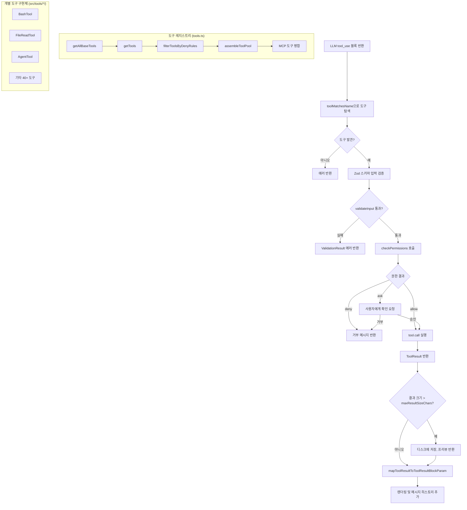

# Tool 시스템: 도구 레지스트리 & 실행 파이프라인

## 1. 개요

Tool 시스템은 Claude Code의 핵심 확장 메커니즘이다. LLM(Large Language Model, 대규모 언어 모델)이 텍스트 생성 외에 실제 작업을 수행할 수 있도록 40개 이상의 도구를 등록, 검증, 실행하는 파이프라인 전체를 관할한다.

**역할 요약:**
- **등록**: 빌트인(built-in, 내장) 도구와 MCP(Model Context Protocol) 도구를 단일 풀(pool)로 조합
- **검증**: Zod v4 스키마 기반 입력 유효성 검사 및 권한 확인
- **실행**: `ToolUseContext`를 의존성 주입(dependency injection) 컨테이너로 활용하여 각 도구에 실행 환경 전달
- **결과 처리**: 결과 포맷팅, 대용량 결과의 디스크 저장, UI 렌더링

**파일 구조:**

| 파일 | 역할 |
|------|------|
| `src/Tool.ts` | 핵심 타입 및 인터페이스 정의 |
| `src/tools.ts` | 도구 레지스트리 및 조합 로직 |
| `src/tools/*/` | 개별 도구 구현체 (40개 이상) |

---

## 2. 아키텍처 다이어그램



---

## 3. 핵심 타입 및 인터페이스

`src/Tool.ts`는 792줄 규모의 타입 전용 파일로, 런타임 코드를 최소화하고 타입 시스템을 통해 도구 계약(contract)을 강제한다.

### 3.1 `ToolInputJSONSchema`

```typescript
export type ToolInputJSONSchema = {
  [x: string]: unknown
  type: 'object'
  properties?: {
    [x: string]: unknown
  }
}
```

MCP 도구처럼 Zod 스키마 대신 JSON Schema를 직접 사용하는 도구를 위한 타입이다. 빌트인 도구는 `inputSchema: Input`(Zod 기반)을 사용하고, MCP 도구는 `inputJSONSchema`를 사용하는 두 경로가 공존한다.

### 3.2 `ToolPermissionContext`

```typescript
export type ToolPermissionContext = DeepImmutable<{
  mode: PermissionMode
  additionalWorkingDirectories: Map<string, AdditionalWorkingDirectory>
  alwaysAllowRules: ToolPermissionRulesBySource
  alwaysDenyRules: ToolPermissionRulesBySource
  alwaysAskRules: ToolPermissionRulesBySource
  isBypassPermissionsModeAvailable: boolean
  isAutoModeAvailable?: boolean
  strippedDangerousRules?: ToolPermissionRulesBySource
  shouldAvoidPermissionPrompts?: boolean
  awaitAutomatedChecksBeforeDialog?: boolean
  prePlanMode?: PermissionMode
}>
```

`DeepImmutable<T>`로 감싸져 있어 런타임 중 권한 컨텍스트가 변경되지 않음을 타입 수준에서 보장한다. `alwaysAllowRules`, `alwaysDenyRules`, `alwaysAskRules`는 각각 소스(source)별로 분류된 규칙 맵으로, `.claude/settings.json`의 훅(hook) 설정이 여기에 반영된다.

### 3.3 `ToolUseContext`

전체 시스템에서 가장 복잡한 타입이다. 모든 `tool.call()`에 전달되는 의존성 주입 컨테이너 역할을 한다.

**주요 필드 분류:**

| 카테고리 | 필드 | 설명 |
|----------|------|------|
| 설정 | `options.tools`, `options.commands`, `options.mainLoopModel` | 런타임 설정 |
| 상태 관리 | `getAppState()`, `setAppState()` | React 상태 접근자 |
| 세션 인프라 | `setAppStateForTasks` | 서브에이전트에서도 루트 스토어에 접근 가능 |
| UI 콜백 | `setToolJSX`, `addNotification`, `appendSystemMessage` | UI 업데이트 함수 |
| 중단 제어 | `abortController` | 도구 실행 취소 신호 |
| 파일 캐시 | `readFileState: FileStateCache` | LRU 캐시 기반 파일 상태 |
| 컨텍스트 추적 | `queryTracking`, `toolDecisions` | 체인 추적 및 결정 기록 |
| 에이전트 식별 | `agentId`, `agentType` | 서브에이전트 구분 |
| 권한 관련 | `localDenialTracking`, `requireCanUseTool` | 비동기 서브에이전트용 거부 추적 |
| 프롬프트 캐시 | `renderedSystemPrompt`, `contentReplacementState` | 캐시 공유 최적화 |

`setAppStateForTasks`는 일반 `setAppState`와 다르게 비동기 서브에이전트에서도 루트 AppState에 접근할 수 있도록 설계된 점이 특징이다. 일반 `setAppState`는 비동기 에이전트에서 no-op(무작동)으로 작동하여 격리를 유지하지만, 세션 스코프 인프라(예: 백그라운드 태스크 등록)는 루트까지 전파되어야 하기 때문이다.

### 3.4 `ValidationResult`

```typescript
export type ValidationResult =
  | { result: true }
  | { result: false; message: string; errorCode: number }
```

도구 실행 전 사전 검증(pre-flight validation) 결과 타입이다. 실패 시 `message`가 LLM에게 반환되어 모델이 입력을 수정할 수 있도록 안내한다.

### 3.5 `Tool` 인터페이스

```typescript
export type Tool<
  Input extends AnyObject = AnyObject,
  Output = unknown,
  P extends ToolProgressData = ToolProgressData,
> = {
  name: string
  aliases?: string[]
  inputSchema: Input
  inputJSONSchema?: ToolInputJSONSchema
  maxResultSizeChars: number
  call(args, context, canUseTool, parentMessage, onProgress?): Promise<ToolResult<Output>>
  description(input, options): Promise<string>
  checkPermissions(input, context): Promise<PermissionResult>
  validateInput?(input, context): Promise<ValidationResult>
  isConcurrencySafe(input): boolean
  isReadOnly(input): boolean
  isDestructive?(input): boolean
  // ... UI 렌더링 메서드 다수
}
```

제네릭 파라미터 3개가 입력 스키마 타입(`Input`), 출력 타입(`Output`), 진행 상태 타입(`P`)을 각각 고정한다. UI 렌더링 관련 메서드(`renderToolResultMessage`, `renderToolUseMessage` 등)가 도구 인터페이스에 직접 포함된 점이 이 설계의 특징으로, 도구 로직과 렌더링 로직이 같은 모듈 내에 공존한다.

### 3.6 `buildTool` 팩토리 함수

```typescript
export function buildTool<D extends AnyToolDef>(def: D): BuiltTool<D> {
  return {
    ...TOOL_DEFAULTS,
    userFacingName: () => def.name,
    ...def,
  } as BuiltTool<D>
}
```

모든 도구는 `buildTool`을 통해 생성되며, 다음 기본값이 주입된다:

| 메서드 | 기본값 | 설계 원칙 |
|--------|--------|-----------|
| `isEnabled` | `() => true` | 명시적 비활성화 없이는 활성 |
| `isConcurrencySafe` | `() => false` | 실패 안전(fail-closed): 기본적으로 동시 실행 불가 |
| `isReadOnly` | `() => false` | 기본적으로 쓰기 작업으로 간주 |
| `isDestructive` | `() => false` | 기본적으로 비파괴적 |
| `checkPermissions` | `allow` 반환 | 일반 권한 시스템에 위임 |
| `toAutoClassifierInput` | `() => ''` | 보안 분류기에서 제외 |
| `userFacingName` | `() => def.name` | 도구명을 그대로 표시 |

`BuiltTool<D>` 타입은 타입 수준 스프레드(spread)를 통해 런타임 `{...TOOL_DEFAULTS, ...def}` 의미론을 정확히 반영한다.

### 3.7 `Tools` 타입

```typescript
export type Tools = readonly Tool[]
```

`Tool[]` 대신 이 타입을 사용함으로써 코드베이스 전체에서 도구 집합이 조합, 전달, 필터링되는 지점을 타입 시스템으로 추적할 수 있다.

---

## 4. Tool 레지스트리 (`tools.ts`)

`src/tools.ts`는 도구 등록 방식을 세 가지 패턴으로 분류한다.

### 4.1 정적 임포트 (Static Import)

핵심 도구들은 ES 모듈 정적 임포트로 등록된다:

```typescript
import { AgentTool } from './tools/AgentTool/AgentTool.js'
import { BashTool } from './tools/BashTool/BashTool.js'
import { FileEditTool } from './tools/FileEditTool/FileEditTool.js'
// ...
```

번들러(bundler)가 빌드 시점에 포함 여부를 결정할 수 있어 트리 셰이킹(tree shaking)이 적용된다.

### 4.2 조건부 `require()` — 기능 플래그 기반

`bun:bundle`의 `feature()` 함수를 활용한 dead code elimination(데드 코드 제거) 패턴이다:

```typescript
import { feature } from 'bun:bundle'

const SleepTool = feature('PROACTIVE') || feature('KAIROS')
  ? require('./tools/SleepTool/SleepTool.js').SleepTool
  : null

const cronTools = feature('AGENT_TRIGGERS')
  ? [
      require('./tools/ScheduleCronTool/CronCreateTool.js').CronCreateTool,
      // ...
    ]
  : []
```

`feature()` 플래그가 `false`인 경우, 번들러는 해당 `require()` 브랜치 전체를 빌드 산출물에서 제거한다. 이는 프로덕션 번들 크기를 최소화하는 동시에 기능별 점진적 배포를 가능하게 한다.

### 4.3 조건부 `require()` — 환경 변수 기반

`USER_TYPE` 환경 변수로 Ant(내부 Anthropic) 전용 도구를 분리한다:

```typescript
const REPLTool =
  process.env.USER_TYPE === 'ant'
    ? require('./tools/REPLTool/REPLTool.js').REPLTool
    : null
```

이 패턴을 사용하는 도구: `REPLTool`, `SuggestBackgroundPRTool`, `ConfigTool`, `TungstenTool`.

### 4.4 지연 `require()` — 순환 의존성 해결

`TeamCreateTool`, `TeamDeleteTool`, `SendMessageTool`은 순환 의존성(circular dependency)을 해결하기 위해 지연 로딩(lazy loading)된다:

```typescript
// Lazy require to break circular dependency: tools.ts -> TeamCreateTool/TeamDeleteTool -> ... -> tools.ts
const getTeamCreateTool = () =>
  require('./tools/TeamCreateTool/TeamCreateTool.js')
    .TeamCreateTool as typeof import('./tools/TeamCreateTool/TeamCreateTool.js').TeamCreateTool
```

이 팀 도구들은 `tools.ts`를 임포트하는 모듈 체인에 속하므로, 정적 임포트로 처리하면 모듈 초기화 시점에 순환이 발생한다. 지연 함수로 감싸면 실제 호출 시점까지 로딩을 미룰 수 있다.

### 4.5 `getAllBaseTools()` 함수

전체 도구 목록의 단일 진실 공급원(single source of truth)이다:

```typescript
export function getAllBaseTools(): Tools {
  return [
    AgentTool,
    TaskOutputTool,
    BashTool,
    ...(hasEmbeddedSearchTools() ? [] : [GlobTool, GrepTool]),
    // ...
    ...(isTodoV2Enabled()
      ? [TaskCreateTool, TaskGetTool, TaskUpdateTool, TaskListTool]
      : []),
    // ...
    ...(isToolSearchEnabledOptimistic() ? [ToolSearchTool] : []),
  ]
}
```

주석에 따르면 이 목록은 Statsig 시스템 프롬프트 캐싱 설정(`claude_code_global_system_caching`)과 동기화를 유지해야 한다. 도구 순서가 바뀌면 프롬프트 캐시 키가 무효화될 수 있기 때문이다.

### 4.6 `getTools()` 함수

권한 컨텍스트를 적용하여 실제 사용 가능한 도구 목록을 반환한다:

```typescript
export const getTools = (permissionContext: ToolPermissionContext): Tools => {
  // 1. CLAUDE_CODE_SIMPLE 환경 변수: Bash/Read/Edit만 반환
  if (isEnvTruthy(process.env.CLAUDE_CODE_SIMPLE)) { ... }

  // 2. 특수 도구 제외 (ListMcpResources 등 별도 경로로 추가)
  const tools = getAllBaseTools().filter(tool => !specialTools.has(tool.name))

  // 3. Deny 규칙으로 도구 필터링
  let allowedTools = filterToolsByDenyRules(tools, permissionContext)

  // 4. REPL 모드: 원시 도구 숨김 (REPL 내부 VM에서만 접근 가능)
  if (isReplModeEnabled()) { ... }

  // 5. isEnabled() 검사
  return allowedTools.filter((_, i) => isEnabled[i])
}
```

### 4.7 `assembleToolPool()` 함수

빌트인 도구와 MCP 도구를 하나의 풀로 결합하는 최종 조합 함수다:

```typescript
export function assembleToolPool(
  permissionContext: ToolPermissionContext,
  mcpTools: Tools,
): Tools {
  const builtInTools = getTools(permissionContext)
  const allowedMcpTools = filterToolsByDenyRules(mcpTools, permissionContext)

  // 빌트인 도구를 앞쪽 연속 블록으로 유지하여 프롬프트 캐시 안정성 확보
  const byName = (a: Tool, b: Tool) => a.name.localeCompare(b.name)
  return uniqBy(
    [...builtInTools].sort(byName).concat(allowedMcpTools.sort(byName)),
    'name',
  )
}
```

정렬 시 빌트인 도구와 MCP 도구를 별도 파티션으로 유지하는 이유는 프롬프트 캐시 안정성(prompt cache stability) 때문이다. 서버 측 캐시 정책이 빌트인 도구 블록 끝에 캐시 브레이크포인트(cache breakpoint)를 두므로, 두 파티션을 평탄하게 섞으면 MCP 도구가 빌트인 목록 사이에 끼어들어 캐시 키가 무효화된다.

---

## 5. Tool 실행 파이프라인

LLM이 `tool_use` 블록을 반환한 시점부터 결과가 대화 히스토리에 기록되기까지의 전체 흐름이다.

### 단계 1: 도구 탐색

```typescript
export function toolMatchesName(
  tool: { name: string; aliases?: string[] },
  name: string,
): boolean {
  return tool.name === name || (tool.aliases?.includes(name) ?? false)
}

export function findToolByName(tools: Tools, name: string): Tool | undefined {
  return tools.find(t => toolMatchesName(t, name))
}
```

`aliases` 필드는 도구명이 변경될 때 하위 호환성(backward compatibility)을 유지하기 위한 장치다. 구 도구명으로 호출된 LLM 요청도 새 도구로 라우팅된다.

### 단계 2: 입력 검증

Zod v4 스키마로 입력을 파싱한다. 파싱 실패 시 구조화된 에러 메시지가 LLM에 반환되어 모델이 입력을 수정하도록 유도한다.

옵셔널 메서드 `validateInput`이 구현된 경우, Zod 파싱 통과 후 추가적인 도구별 검증이 실행된다:

```typescript
validateInput?(
  input: z.infer<Input>,
  context: ToolUseContext,
): Promise<ValidationResult>
```

### 단계 3: 권한 확인

```typescript
checkPermissions(
  input: z.infer<Input>,
  context: ToolUseContext,
): Promise<PermissionResult>
```

`PermissionResult`의 `behavior` 필드에 따라 실행 경로가 분기된다:

| behavior | 동작 |
|----------|------|
| `allow` | 즉시 실행 |
| `deny` | 거부 메시지 반환, LLM에 전달 |
| `ask` | 사용자에게 확인 UI 표시 |

`buildTool`의 기본 구현은 `allow`를 반환하여 일반 권한 시스템(`permissions.ts`)에 위임한다. 도구별 특수 로직이 필요한 경우에만 이 메서드를 오버라이드한다.

### 단계 4: 실행

```typescript
call(
  args: z.infer<Input>,
  context: ToolUseContext,
  canUseTool: CanUseToolFn,
  parentMessage: AssistantMessage,
  onProgress?: ToolCallProgress<P>,
): Promise<ToolResult<Output>>
```

`ToolUseContext`는 도구가 필요로 하는 모든 의존성(앱 상태, 파일 캐시, 중단 컨트롤러, UI 콜백 등)을 담은 컨테이너로 전달된다. `onProgress` 콜백을 통해 실행 중 진행 상태를 스트리밍할 수 있다.

### 단계 5: 결과 처리

```typescript
export type ToolResult<T> = {
  data: T
  newMessages?: (UserMessage | AssistantMessage | AttachmentMessage | SystemMessage)[]
  contextModifier?: (context: ToolUseContext) => ToolUseContext
  mcpMeta?: { _meta?: Record<string, unknown>; structuredContent?: Record<string, unknown> }
}
```

`contextModifier`는 동시 실행에 안전하지 않은 도구(`isConcurrencySafe = false`)에서만 사용 가능하며, 도구 결과에 따라 `ToolUseContext`를 변경할 수 있다. 예를 들어 `EnterPlanModeTool`은 이를 통해 권한 모드를 전환한다.

### 단계 6: 결과 직렬화 및 저장

```typescript
maxResultSizeChars: number
mapToolResultToToolResultBlockParam(
  content: Output,
  toolUseID: string,
): ToolResultBlockParam
```

결과 크기가 `maxResultSizeChars`를 초과하면 디스크에 저장하고 LLM에는 파일 경로와 프리뷰만 전달한다. `FileReadTool`의 경우 이 값이 `Infinity`로 설정되어 있는데, 파일 내용을 디스크에 다시 저장하면 `Read → 파일 → Read` 순환이 발생하고 이미 자체적으로 크기 제한을 적용하기 때문이다.

### 단계 7: 에러 처리

도구는 에러 UI를 커스터마이즈할 수 있다:

```typescript
renderToolUseErrorMessage?(
  result: ToolResultBlockParam['content'],
  options: { ... },
): React.ReactNode
```

이 메서드가 없으면 `<FallbackToolUseErrorMessage />`가 사용된다. 파일 탐색 도구처럼 "파일을 찾을 수 없습니다" 같은 도구별 에러 메시지가 필요한 경우에만 구현한다.

---

## 6. Tool 카테고리 분석

`src/tools/` 디렉토리의 모든 도구를 카테고리별로 분류한다.

### 파일 조작

| 도구 | 설명 | 읽기 전용 |
|------|------|-----------|
| `FileReadTool` | 파일 읽기, 이미지/PDF/노트북 지원 | O |
| `FileEditTool` | 파일 일부 편집 (문자열 대체) | X |
| `FileWriteTool` | 파일 생성 및 전체 덮어쓰기 | X |
| `GlobTool` | 파일 패턴 탐색 | O |
| `GrepTool` | 파일 내용 패턴 검색 (ripgrep 래핑) | O |
| `NotebookEditTool` | Jupyter 노트북 셀 편집 | X |

`GlobTool`과 `GrepTool`은 `hasEmbeddedSearchTools()`가 `true`인 경우(Ant 내부 빌드) 제외된다. Ant 빌드에는 bfs/ugrep이 Bun 바이너리에 내장되어 있고, Bash 내에서 `find`/`grep` 명령이 이 빠른 도구로 앨리어스(alias)되기 때문이다.

### 실행

| 도구 | 설명 |
|------|------|
| `BashTool` | 셸 명령 실행 (샌드박스 지원) |
| `REPLTool` | 격리된 VM 환경에서 코드 실행 (Ant 전용) |
| `PowerShellTool` | Windows PowerShell 명령 실행 |

`BashTool`은 파이프라인 구성 명령을 분석하여 검색/읽기/목록 조회 명령인지 판단하고 UI에서 접을 수 있게(collapsible) 표시한다. 이를 위해 `BASH_SEARCH_COMMANDS`, `BASH_READ_COMMANDS`, `BASH_LIST_COMMANDS`, `BASH_SEMANTIC_NEUTRAL_COMMANDS` 집합을 사용한다.

### 에이전트

| 도구 | 설명 |
|------|------|
| `AgentTool` | 서브에이전트 생성 및 실행 |
| `SendMessageTool` | 팀 내 에이전트 간 메시지 전송 |
| `TeamCreateTool` | 에이전트 팀 생성 |
| `TeamDeleteTool` | 에이전트 팀 해체 |

`AgentTool`은 시스템에서 가장 복잡한 도구로, 로컬/원격 에이전트 실행, 워크트리(worktree) 생성, 포크(fork) 서브에이전트, 코디네이터 모드 등 다수의 실행 경로를 포함한다. `AgentTool`의 임포트 목록만 80줄에 달한다.

### 태스크 관리

| 도구 | 설명 |
|------|------|
| `TaskCreateTool` | 새 태스크 생성 |
| `TaskGetTool` | 태스크 상태 조회 |
| `TaskListTool` | 태스크 목록 조회 |
| `TaskUpdateTool` | 태스크 업데이트 |
| `TaskOutputTool` | 태스크 출력 스트리밍 |
| `TaskStopTool` | 태스크 중단 |

태스크 관련 도구 6개는 `isTodoV2Enabled()` 플래그로 일괄 활성화/비활성화된다.

### MCP / LSP

| 도구 | 설명 |
|------|------|
| `MCPTool` | MCP 서버 도구 래퍼 (동적) |
| `LSPTool` | Language Server Protocol 통합 |
| `McpAuthTool` | MCP 인증 처리 |
| `ListMcpResourcesTool` | MCP 서버 리소스 목록 |
| `ReadMcpResourceTool` | MCP 리소스 내용 읽기 |

`ListMcpResourcesTool`과 `ReadMcpResourceTool`은 `getTools()`에서 `specialTools` 집합으로 분리되어 별도 경로로 추가된다. `LSPTool`은 `ENABLE_LSP_TOOL` 환경 변수로 명시적으로 활성화해야 한다.

### 워크플로우 제어

| 도구 | 설명 |
|------|------|
| `EnterPlanModeTool` | Plan 모드 진입 (쓰기 작업 차단) |
| `ExitPlanModeV2Tool` | Plan 모드 종료 |
| `EnterWorktreeTool` | Git 워크트리 모드 진입 |
| `ExitWorktreeTool` | Git 워크트리 모드 종료 |
| `SkillTool` | 스킬 파일 실행 |
| `ToolSearchTool` | 지연 로드된 도구 검색 |

`EnterWorktreeTool`과 `ExitWorktreeTool`은 `isWorktreeModeEnabled()` 조건으로 등록된다.

### 사용자 상호작용

| 도구 | 설명 |
|------|------|
| `AskUserQuestionTool` | 사용자에게 질문 및 응답 수집 |
| `BriefTool` | 간략한 상태 업데이트 표시 |
| `ConfigTool` | 설정 읽기/쓰기 (Ant 전용) |
| `TodoWriteTool` | 할 일 목록 업데이트 |
| `SleepTool` | 실행 일시 중지 (PROACTIVE/KAIROS) |

`TodoWriteTool`은 `renderToolResultMessage`를 구현하지 않는 도구의 예시다. 이 도구는 결과를 투명 패널(todo panel)로 업데이트하므로 대화 트랜스크립트(transcript)에 별도 결과를 출력하지 않는다.

### 웹 접근

| 도구 | 설명 |
|------|------|
| `WebFetchTool` | URL에서 HTML/텍스트 가져오기 |
| `WebSearchTool` | 웹 검색 실행 |

### 기타 (실험적/내부)

| 도구 | 설명 | 조건 |
|------|------|------|
| `SyntheticOutputTool` | 합성 출력 생성 | 항상 특수 처리 |
| `RemoteTriggerTool` | 원격 트리거 실행 | `AGENT_TRIGGERS_REMOTE` 플래그 |
| `ScheduleCronTool` 계열 | 크론 작업 관리 | `AGENT_TRIGGERS` 플래그 |
| `SleepTool` | 에이전트 슬립 | `PROACTIVE` 또는 `KAIROS` 플래그 |
| `TungstenTool` | 내부 도구 | Ant 전용 |
| `TestingPermissionTool` | 권한 테스트 | `NODE_ENV === 'test'` |

---

## 7. 주요 설계 결정

### 7.1 Zod v4 기반 스키마 검증

빌드 시점과 런타임 모두에서 타입 안전성을 보장하기 위해 Zod v4를 채택했다. `z.infer<Input>`으로 입력 타입을 자동 추론하므로 별도의 타입 정의가 불필요하다. 또한 Zod 스키마는 Anthropic API가 요구하는 JSON Schema로 직렬화되어 LLM에 도구 명세로 전달된다.

`lazySchema` 패턴이 다수의 도구에서 사용된다:

```typescript
// FileReadTool.tsx에서
import { lazySchema } from '../../utils/lazySchema.js'
```

이는 스키마 생성 비용이 높거나 순환 의존성이 있는 경우, 실제 사용 시점까지 스키마 평가를 지연시키는 패턴이다.

### 7.2 조건부 도구 로딩과 번들 크기 최적화

`bun:bundle`의 `feature()` 함수는 Bun의 번들러가 이해하는 특수 API다. `feature('FLAG_NAME')`이 `false`로 평가되는 빌드에서는 해당 `require()` 브랜치가 번들에서 완전히 제거된다. 이를 통해:

1. 프로덕션 빌드 크기 최소화
2. 미완성 기능의 코드가 배포되지 않음 보장
3. A/B 테스트 및 단계적 기능 롤아웃 지원

런타임 기능 플래그(`isEnvTruthy`, `process.env.USER_TYPE`)와 빌드 타임 플래그(`feature()`)를 구분하여 사용하는 점이 특징이다.

### 7.3 `ToolUseContext`의 의존성 주입 패턴

모든 도구가 단일 `context: ToolUseContext` 인수를 통해 필요한 의존성에 접근한다. 이 패턴의 장점:

- **테스트 용이성**: 컨텍스트 객체를 모킹(mocking)하여 도구를 격리 테스트 가능
- **확장성**: 새 의존성을 추가할 때 함수 시그니처를 변경하지 않고 컨텍스트에 필드만 추가
- **서브에이전트 격리**: `setAppState`가 서브에이전트에서 no-op으로 작동하도록 컨텍스트를 교체하여 격리 달성

단점으로는 컨텍스트 타입이 매우 커진다는 점이 있다 — `ToolUseContext`는 약 50개의 필드를 포함한다.

### 7.4 프롬프트 캐시 안정성 설계

`assembleToolPool`이 빌트인/MCP 도구를 별도 파티션으로 정렬하는 이유는 Anthropic API의 프롬프트 캐싱 메커니즘과 직접 연관된다. 서버 측 캐시 정책은 빌트인 도구 목록 끝에 캐시 브레이크포인트를 배치하는데, 도구 순서가 변경되면 이 브레이크포인트 이후의 모든 토큰이 캐시 미스(cache miss)가 된다. 이 설계를 통해 MCP 서버 연결/해제가 빈번해도 빌트인 도구 캐시는 유지된다.

### 7.5 `shouldDefer` / `alwaysLoad` — 지연 도구 로딩

도구 수가 많아지면 LLM에 전달되는 프롬프트 크기가 크게 증가한다. `shouldDefer: true`인 도구는 초기 프롬프트에서 스키마가 생략되고(`defer_loading: true` 플래그로 API에 전달), `ToolSearchTool`을 통해 필요 시 온디맨드(on-demand)로 스키마를 가져올 수 있다:

```typescript
readonly shouldDefer?: boolean
readonly alwaysLoad?: boolean  // 지연 도구 중에서도 항상 초기 로드
```

이를 통해 40개 이상의 도구를 보유하면서도 초기 컨텍스트 토큰 소비를 최소화한다.

---

## 8. 실제 도구 구현 패턴

### BashTool 구현 패턴

```typescript
// BashTool.tsx (단순화)
export const BashTool = buildTool({
  name: BASH_TOOL_NAME,
  // 1. Zod 스키마 정의
  inputSchema: lazySchema(() => z.object({
    command: z.string(),
    timeout: z.number().optional(),
  })),
  // 2. 핵심 실행 로직
  async call(args, context, canUseTool, parentMessage, onProgress) {
    // ... 실행 로직
  },
  // 3. 검색/읽기 명령 판별
  isSearchOrReadCommand(input) {
    return isSearchOrReadBashCommand(input.command)
  },
  // 4. 읽기 전용 여부 (기본값 false 사용)
  isReadOnly: () => false,
})
```

### FileReadTool 구현 패턴

`FileReadTool.tsx`는 빌드 시점에 수십 개의 유틸리티를 임포트하는 복잡한 도구다. PDF, 이미지, Jupyter 노트북, 일반 텍스트 등 다양한 파일 형식을 처리하며, `maxResultSizeChars: Infinity`를 통해 결과가 디스크에 저장되지 않도록 보장한다.

---

## 내비게이션

- 이전: [QueryEngine](query-engine.md)
- 다음: [권한 시스템](permission-system.md)
- 상위: [목차](../README.md)
