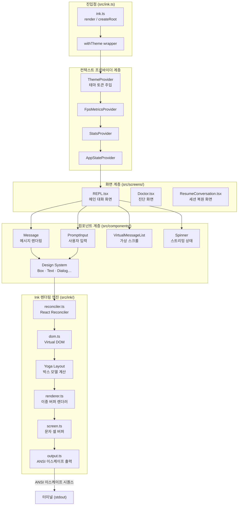

# UI 시스템: React/Ink CLI 인터페이스 분석

> **Level 2 — 시스템 심층 분석**
> 관련 문서: [쿼리 엔진](query-engine.md) · [도구 시스템](tool-system.md) · [권한 시스템](permission-system.md) · [에이전트 코디네이터](agent-coordinator.md)

---

## 1. 개요

Claude Code의 사용자 인터페이스는 **React와 Ink를 조합**하여 터미널(CLI) 환경에서 풍부한 대화형 UI를 구현한다. 브라우저의 DOM 대신 터미널 표준 출력을 렌더링 대상으로 삼는다는 점에서, 이 시스템은 전통적인 웹 프론트엔드와 구조적으로 동일하면서도 렌더링 파이프라인이 근본적으로 다르다.

주요 규모 지표:

| 항목 | 수치 |
|------|------|
| `src/components/` 직속 파일·디렉터리 수 | 140+ |
| `src/screens/` 화면 수 | 3 (REPL, Doctor, ResumeConversation) |
| `src/ink/` 커스텀 Ink 엔진 파일 수 | 40+ |
| 디자인 시스템 컴포넌트 수 | 16 |

아키텍처 관점에서 UI 시스템의 핵심 특성은 세 가지다.

1. **React 컴파일러 최적화**: 모든 컴포넌트에 `react/compiler-runtime`의 `_c()` 캐시 훅이 자동 삽입되어, 수동 `useMemo`/`useCallback` 없이도 세밀한 리렌더링 방지가 이루어진다.
2. **커스텀 Ink 포크**: 오픈소스 Ink 라이브러리를 포크하여 Yoga 레이아웃 엔진, 이중 버퍼(front/back frame) 렌더러, 선택 오버레이, 하이퍼링크 풀 등 고성능 기능을 추가했다.
3. **ThemeProvider 래핑**: 모든 `render()` 호출은 `src/ink.ts`의 `withTheme()` 함수를 통해 자동으로 `ThemeProvider`로 감싸져, 테마-무관 Ink 엔진 위에 디자인 시스템 토큰이 주입된다.

---

## 2. 아키텍처 다이어그램



데이터 흐름 방향은 단방향이다. React 상태 변경 → Reconciler가 Virtual DOM 패치 → Yoga 레이아웃 재계산 → 이중 버퍼 비교(diff) → 변경된 셀만 ANSI 시퀀스로 출력.

---

## 3. Ink 프레임워크 개요

### 3.1 React for CLI의 원리

Ink는 React의 `react-reconciler` 패키지를 사용하여 브라우저 DOM 대신 **커스텀 호스트 환경(터미널)**을 렌더링 대상으로 연결한다. 웹의 `ReactDOM.createRoot()`가 DOM 노드를 받는 것처럼, Ink의 reconciler는 터미널 stdout 스트림에 연결된다.

`src/ink/reconciler.ts`는 `createReconciler()`를 호출하며, 커스텀 호스트 메서드(`createInstance`, `appendChildToContainer`, `commitUpdate` 등)를 구현한다. 이 메서드들은 `src/ink/dom.ts`의 가상 DOM을 조작하며, 각 DOM 노드는 Yoga 레이아웃 노드(`yogaNode`)를 보유한다.

```
React 컴포넌트 트리
       ↓  (react-reconciler)
   Virtual DOM (DOMElement)
       ↓  (Yoga 레이아웃)
   계산된 위치·크기
       ↓  (renderer.ts)
   이중 버퍼 (front / back frame)
       ↓  (screen.ts)
   문자 셀 배열 (CharCell[])
       ↓  (output.ts)
   ANSI 이스케이프 시퀀스 → stdout
```

### 3.2 이중 버퍼 렌더러

`src/ink/renderer.ts`는 `frontFrame`과 `backFrame` 두 버퍼를 유지한다. 매 프레임마다 backFrame에 새 화면을 그린 후, frontFrame(현재 화면)과 비교하여 변경된 셀만 터미널에 기록한다. 이는 화면 깜박임을 제거하고 출력 바이트 수를 최소화한다.

렌더러는 `prevFrameContaminated` 플래그를 통해 선택 오버레이, 대체 화면(alt-screen) 전환, 창 크기 변경(SIGWINCH) 등으로 이전 프레임이 오염된 경우 전체 재출력을 수행한다.

### 3.3 Yoga 레이아웃 엔진

Meta의 Yoga 레이아웃 엔진이 박스 모델과 Flexbox 레이아웃을 계산한다. `src/ink/dom.ts`의 각 `DOMElement`는 `yogaNode`를 보유하며, `setStyle()`을 통해 스타일이 적용된다. `calculateLayout()` 호출 후 `getComputedWidth()` / `getComputedHeight()`로 확정된 크기를 얻는다.

렌더러는 `computedHeight`가 `NaN`이거나 음수인 경우(레이아웃 미완료) 빈 프레임을 반환하여 방어적으로 처리한다.

### 3.4 성능 최적화: 문자 캐시와 그래핀 클러스터링

`src/ink/output.ts`는 `charCache`를 통해 토큰화와 유니코드 그래핀 클러스터 분리 결과를 프레임 간에 재사용한다. 대부분의 줄은 프레임 사이에 변경되지 않으므로 이 캐시의 적중률이 높다.

### 3.5 커스텀 진입점 (src/ink.ts)

오픈소스 Ink를 그대로 쓰지 않고, `src/ink.ts`가 공식 진입점 역할을 한다. 이 파일은:

- `render()` / `createRoot()`를 `withTheme()` 래퍼로 감싸 자동 테마 주입
- `ThemedBox`, `ThemedText`를 `Box`, `Text`로 재수출하여 코드베이스 전체가 테마 인식 컴포넌트를 사용하도록 강제
- `FocusManager`, `InputEvent`, `ClickEvent` 등 이벤트 인프라 재수출
- `useInput`, `useApp`, `useStdin` 등 Ink 훅 재수출

---

## 4. 주요 화면 구성

### 4.1 REPL.tsx — 메인 대화 화면

`src/screens/REPL.tsx`는 시스템에서 가장 복잡한 단일 컴포넌트다. 이 파일은 Claude Code의 메인 대화 루프 전체를 조율한다.

**핵심 역할:**

- `PromptInput` 컴포넌트를 통한 사용자 입력 수집 및 제출
- `VirtualMessageList`를 통한 대화 이력 렌더링(가상 스크롤)
- 스트리밍 응답 수신 중 `Spinner` 상태 표시
- 권한 요청 다이얼로그(`PermissionRequest`) 표시
- 멀티-에이전트 스웜(swarm) 세션 관리
- 세션 비용, 토큰 예산, 탭 상태, 터미널 알림 관리

**의존 훅 (주요):**

| 훅 | 역할 |
|----|------|
| `useReplBridge` | IDE 연동 브릿지 |
| `useRemoteSession` | 원격 세션 관리 |
| `useSwarmInitialization` | 멀티-에이전트 초기화 |
| `useApiKeyVerification` | API 키 검증 |
| `useBackgroundTaskNavigation` | 백그라운드 작업 탐색 |
| `useAssistantHistory` | 어시스턴트 응답 이력 |
| `useLogMessages` | 로그 메시지 처리 |

**특수 기능:** `feature('VOICE_MODE')` 플래그를 통한 음성 통합이 조건부로 활성화된다. Bun 번들러의 DCE(Dead Code Elimination)가 비활성화 시 해당 코드를 제거한다.

### 4.2 Doctor.tsx — 진단 화면

시스템 상태, 환경 변수, 연결 상태 등을 점검하는 진단 도구. `--doctor` 플래그로 진입하는 독립 화면이다.

### 4.3 ResumeConversation.tsx — 세션 복원 화면

이전 대화 세션 목록을 표시하고 선택하는 화면. `--resume` 플래그 진입 시 렌더링된다.

---

## 5. 핵심 컴포넌트 분석

### 5.1 메시지 렌더링 시스템

#### Message.tsx — 메시지 라우터

`src/components/Message.tsx`는 메시지 유형에 따라 적절한 하위 컴포넌트로 라우팅하는 **디스패처** 역할을 한다. React 컴파일러가 생성한 `_c(94)` 캐시(94개 슬롯)가 이 컴포넌트의 렌더링 비용을 최소화한다.

지원 메시지 유형과 대응 컴포넌트:

| 메시지 유형 | 렌더링 컴포넌트 |
|-------------|----------------|
| 어시스턴트 텍스트 | `AssistantTextMessage` |
| 어시스턴트 thinking | `AssistantThinkingMessage` |
| 어시스턴트 redacted thinking | `AssistantRedactedThinkingMessage` |
| 도구 사용 요청 | `AssistantToolUseMessage` |
| 도구 사용 결과 | `UserToolResultMessage` |
| 사용자 텍스트 | `UserTextMessage` |
| 사용자 이미지 | `UserImageMessage` |
| 시스템 텍스트 | `SystemTextMessage` |
| 첨부 파일 | `AttachmentMessage` |
| 압축 요약 경계 | `CompactBoundaryMessage` |
| 축약된 읽기/검색 | `CollapsedReadSearchContent` |
| 그룹화된 도구 사용 | `GroupedToolUseContent` |
| 어드바이저 | `AdvisorMessage` |

모든 메시지는 `OffscreenFreeze`로 감싸져, 뷰포트 밖으로 스크롤된 메시지는 React 업데이트를 받지 않는다(렌더링 동결).

#### Markdown.tsx — 마크다운 파서

`marked` 라이브러리로 마크다운을 토큰화한 뒤 Ink 컴포넌트로 변환한다.

**최적화 전략:**

1. **구문 감지 조기 탈출**: 정규식 `MD_SYNTAX_RE`로 마크다운 문법 기호 존재 여부를 먼저 검사한다. 없으면 `marked.lexer` 호출 자체를 건너뛰고 단순 단락 토큰을 직접 생성한다(~3ms 절감).
2. **모듈 수준 LRU 토큰 캐시**: `tokenCache` 맵이 최대 500개 항목을 보관한다. `useMemo`는 언마운트 시 소멸되지만 이 캐시는 컴포넌트 생명주기를 초월하므로, 가상 스크롤로 재마운트된 메시지도 재파싱 없이 토큰을 재사용한다.
3. **코드 하이라이팅 지연 로딩**: `Suspense` + `use()` 패턴으로 구문 강조 결과를 비동기 로드하여 초기 렌더링을 차단하지 않는다.

### 5.2 입력 시스템

#### PromptInput — 사용자 입력 오케스트레이터

`src/components/PromptInput/PromptInput.tsx`는 사용자 입력과 관련된 거의 모든 기능을 통합한다.

**주요 책임:**

- Vim 모드와 일반 모드 간 전환 (`VimTextInput` / 일반 입력)
- 자동완성 및 타입어헤드 제안 (`useTypeahead`, `usePromptSuggestion`)
- 이미지 클립보드 붙여넣기 (`getImageFromClipboard`)
- 화살표 키 이력 탐색 (`useArrowKeyHistory`)
- 이력 검색 (`useHistorySearch`)
- 대기 중인 명령 큐 표시 (`PromptInputQueuedCommands`)
- 권한 모드 표시 및 전환 (`cyclePermissionMode`)
- 에이전트 스웜 직접 메시지 (`parseDirectMemberMessage`)
- 빠른 모드(fast mode) 지원
- 외부 편집기 연동 (`editPromptInEditor`)

`useKeybinding` / `useKeybindings` 훅을 통해 `~/.claude/keybindings.json`의 사용자 정의 단축키를 동적으로 반영한다.

#### VimTextInput.tsx — Vim 모드 입력

`useVimInput` 훅을 통해 Normal/Insert/Visual 모드 전환을 처리한다. `BaseTextInput` 위에 Vim 키바인딩 레이어를 추가하는 구조다. `isTerminalFocused` 상태에 따라 커서 표시 방식(`chalk.inverse` vs 기본)을 전환한다.

#### BaseTextInput.tsx — 저수준 텍스트 입력

커서 위치, 텍스트 선택, 멀티라인 편집, 마스킹(비밀번호) 등 텍스트 입력의 기초 기능을 구현한다. `useInput` 훅으로 키보드 이벤트를 수신한다.

### 5.3 디자인 시스템

`src/components/design-system/`은 테마 인식 기본 컴포넌트 세트를 제공한다.

#### ThemedBox / ThemedText

Ink 기본 `Box` / `Text` 컴포넌트를 래핑하여 `ThemeProvider`의 현재 테마를 자동 적용한다. `src/ink.ts`에서 `Box`, `Text`로 재수출되어 코드베이스 전체가 이 컴포넌트를 사용한다.

#### ThemeProvider

`dark` / `light` / `auto` 세 가지 테마 설정을 관리한다. `auto` 모드에서는 `getSystemThemeName()`으로 터미널 배경색을 감지한 뒤, OSC 11 시퀀스 폴링으로 실시간 보정한다.

**테마 전환 흐름:**

```
사용자 ThemePicker 선택
    → setThemeSetting() / setPreviewTheme()
    → ThemeContext 업데이트
    → useTheme() 구독 컴포넌트 리렌더링
    → 확정 시 saveGlobalConfig() 영속화
```

#### 기타 디자인 시스템 컴포넌트

| 컴포넌트 | 역할 |
|----------|------|
| `Dialog` | 모달 대화상자 기본 레이아웃 |
| `FuzzyPicker` | 퍼지 검색 선택 UI |
| `ProgressBar` | 진행률 표시 |
| `Tabs` | 탭 네비게이션 |
| `Ratchet` | 단방향 값 증가 애니메이션 |
| `StatusIcon` | 상태 아이콘 (성공/실패/대기) |
| `Byline` | 메시지 발신자 표시 |
| `LoadingState` | 로딩 스켈레톤 |
| `KeyboardShortcutHint` | 단축키 힌트 표시 |
| `Divider` | 구분선 |
| `ListItem` | 목록 항목 |
| `Pane` | 분할 패널 |

### 5.4 다이얼로그 및 오버레이

수십 개의 다이얼로그 컴포넌트가 존재하며, 대표적인 것들은 다음과 같다.

| 컴포넌트 | 목적 |
|----------|------|
| `PermissionRequest` | 도구 실행 권한 확인 |
| `MCPServerApprovalDialog` | MCP 서버 승인 |
| `CostThresholdDialog` | 비용 임계값 경고 |
| `GlobalSearchDialog` | 전역 검색 |
| `HistorySearchDialog` | 이력 검색 |
| `ExportDialog` | 대화 내보내기 |
| `IdleReturnDialog` | 유휴 상태 복귀 확인 |
| `BridgeDialog` | IDE 브릿지 연결 |

모든 다이얼로그는 `overlayContext`를 통해 포커스 관리와 배경 UI 차단을 처리한다.

### 5.5 가상 스크롤

`VirtualMessageList.tsx`는 대화 이력이 길어질 때 렌더링 성능을 유지하기 위해 뷰포트에 보이는 메시지만 마운트한다. 스크롤 오프셋을 추적하며 범위 밖의 메시지는 `OffscreenFreeze`를 통해 렌더링을 동결시킨다. `JumpHandle` ref로 특정 메시지로 즉시 이동하는 기능도 지원한다.

### 5.6 MCP 및 권한 관련 컴포넌트

`src/components/mcp/`와 `src/components/permissions/` 디렉터리에는 MCP 서버 연결, 권한 요청 UI가 구현되어 있다. `WorkerPendingPermission`은 멀티-에이전트 환경에서 워커가 권한 대기 중임을 리더에게 시각적으로 알린다.

---

## 6. 스트리밍 응답 렌더링

### 6.1 Spinner 컴포넌트

`src/components/Spinner.tsx`는 Claude가 응답을 생성하는 동안 표시되는 시각적 피드백 컴포넌트다. 단순한 회전 애니메이션을 넘어 다양한 상태 정보를 표현한다.

**SpinnerMode 열거:**

| 모드 | 의미 |
|------|------|
| 일반 | 표준 처리 중 |
| `brief` | 간결한 모드 (최소 UI) |
| 스웜 활성 | 멀티-에이전트 실행 중 |

**표시 정보:**
- 회전 애니메이션 (SHIMMER_INTERVAL_MS 기반 글리머 효과)
- 경과 시간 (`formatSecondsShort`)
- 생성 중인 토큰 수 (`getTurnOutputTokens`)
- 토큰 예산 잔량 (`getCurrentTurnTokenBudget`)
- 활성 도구 이름 (`spinnerTip`)
- 에이전트 트리 (`TeammateSpinnerTree`) — 멀티-에이전트 시
- 스톨 감지 시 색상 변경 (빨간색)

`useAnimationFrame` 훅으로 렌더링 프레임에 동기화된 부드러운 애니메이션을 구현한다.

### 6.2 스트리밍 메시지 렌더링 흐름

```
API 스트림 청크 수신
    → REPL.tsx의 메시지 상태 업데이트
    → Messages.tsx → Message.tsx 리렌더링
    → AssistantTextMessage → Markdown.tsx
    → 증분 토큰 추가 → 부분 파싱
    → Ink reconciler가 변경된 텍스트 셀만 갱신
    → 터미널에 최소 diff 출력
```

React 컴파일러의 자동 메모이제이션이 스트리밍 중에도 변경되지 않은 컴포넌트(이전 메시지들, 상태 표시줄 등)의 불필요한 리렌더링을 방지한다.

### 6.3 MessageResponse.tsx

응답 완료 후 최종 메시지 표시 및 후처리(비용 계산, 이력 저장 등)를 담당하는 컴포넌트. `Spinner`의 `verbose` 플래그와 연동하여 상세/간결 모드를 전환한다.

---

## 7. Vim 모드 연동

### 7.1 아키텍처

Vim 모드는 `PromptInput` → `VimTextInput` → `useVimInput` 훅 계층으로 구성된다.

```
PromptInput (모드 관리자)
    → VimMode 상태 ('normal' | 'insert' | 'visual')
    → VimTextInput (렌더러)
        → useVimInput (키 처리 로직)
            → BaseTextInput (저수준 텍스트 조작)
```

### 7.2 useVimInput 훅

Vim 키바인딩의 실제 처리를 담당한다. 주요 구현 사항:

- **Normal 모드**: `h/j/k/l` 이동, `w/b/e` 단어 이동, `0/$` 줄 처음/끝, `dd` 줄 삭제, `yy` 복사, `p` 붙여넣기, `u` 실행 취소, `i/a/A/I/o/O` Insert 진입
- **Insert 모드**: 일반 텍스트 입력, `Esc`로 Normal 복귀
- **Visual 모드**: 텍스트 선택, `y` 복사, `d` 삭제

### 7.3 VimTextInput의 렌더링 전략

`isTerminalFocused`와 `props.showCursor`에 따라 커서 표시 방식을 결정한다:

- 터미널 포커스 O + Normal 모드: `chalk.inverse` (반전 배경으로 블록 커서)
- Insert 모드: 밑줄 커서 또는 숨김
- 터미널 포커스 X: 커서 숨김

React 컴파일러가 생성한 `_c(38)` 캐시(38개 슬롯)가 커서 위치나 모드 이외의 props 변경 시 불필요한 `useVimInput` 재실행을 방지한다.

---

## 내비게이션

**상위 문서:** [Level 2 시스템 개요](../README.md)

**동일 레벨 문서:**
- [쿼리 엔진](query-engine.md) — API 통신 및 스트리밍 처리
- [도구 시스템](tool-system.md) — 도구 실행 및 결과 처리
- [권한 시스템](permission-system.md) — 권한 요청 및 승인 흐름
- [에이전트 코디네이터](agent-coordinator.md) — 멀티-에이전트 조율

**하위 문서 (Level 3):**
- `src/ink/reconciler.ts` — React Reconciler 구현 상세
- `src/ink/renderer.ts` — 이중 버퍼 렌더러 상세
- `src/components/design-system/` — 디자인 시스템 컴포넌트 전체 목록
